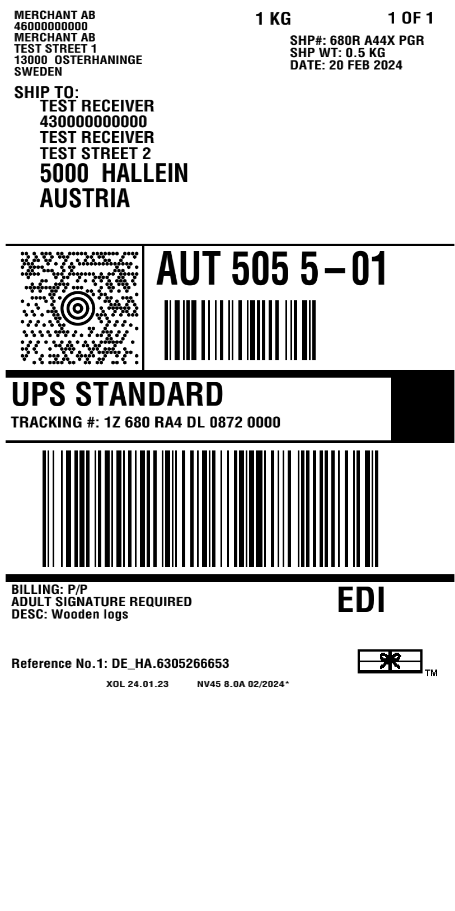

# Zebrash

Library for rendering ZPL (Zebra Programming Language) files as raster images

- Partially based on https://github.com/BinaryKits/BinaryKits.Zpl
- Uses slightly modified implementations of:
	- PDF417, Aztec and Code 2 of 5 barcodes from https://github.com/boombuler/barcode/
	- Code 128, Code 39 and DataMatrix from https://github.com/makiuchi-d/gozxing

## Description

This library emulates subset of ZPL engine and allows you to view most of the ZPL labels that are used by carriers such as Fedex, UPS or DHL as PNGs without the need to possess physical Zebra-compatible printer.
Think of https://labelary.com/viewer.html except it is completely free for commercial use, has no API limits and can easily be self-hosted or plugged into existing Go application so you don't need to send labels with real customers information to some 3rd-party servers

Example of the output (more examples can be found inside `testdata` folder):




## Usage:

```go

	file, err := os.ReadFile("./testdata/label.zpl")
	if err != nil {
		t.Fatal(err)
	}

	parser := zebrash.NewParser()

	res, err := parser.Parse(file)
	if err != nil {
		t.Fatal(err)
	}

	var buff bytes.Buffer

	drawer := zebrash.NewDrawer()

	err = drawer.DrawLabelAsPng(res[0], &buff, drawers.DrawerOptions{
		LabelWidthMm:  101.6,
		LabelHeightMm: 203.2,
		Dpmm:          8,
	})
	if err != nil {
		t.Fatal(err)
	}

	err = os.WriteFile("./testdata/label.png", buff.Bytes(), 0744)
	if err != nil {
		t.Fatal(err)
	}

```